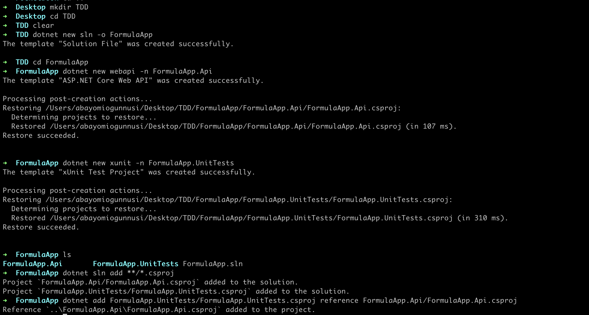

##### Create a new foler
- mkdir TDD
- cd TDD

##### Create a new solution
- dotnet new sln -o FormulaApp
- cd FormulaApp

##### Create a new Api
- dotnet new webapi -n FormulaApp.Api // the difference between -n and -o is that -n is for the name of the project and -o is for the name of the folder

##### Create a new Test project
- dotnet new xunit -n FormulaApp.UnitTests

##### Add the Api project to the solution
- dotnet sln add **/*.csproj

##### Add Api project reference to the Test project
- dotnet add FormulaApp.UnitTests/FormulaApp.UnitTests.csproj reference FormulaApp.Api/FormulaApp.Api.csproj

##### Add the following packages to the UnitTests project
- cd FormulaApp.UnitTests
- dotnet add package Moq
- dotnet add package FluentAssertions